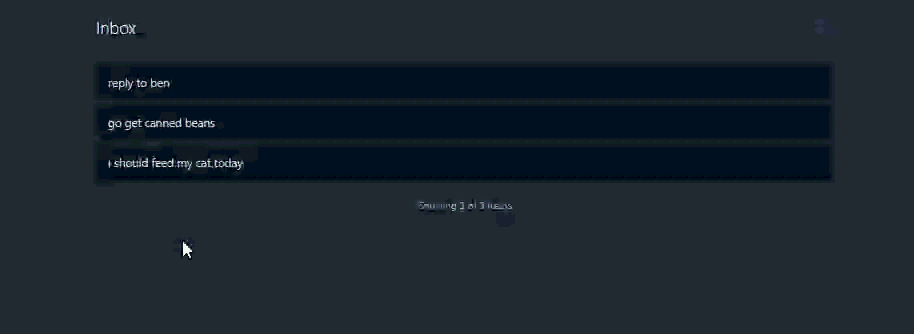

# Tududi User Guide

This guide covers how to use Tududi, the task management application, once you have it installed via the Home Assistant Add-on.

## Table of Contents

- [Getting Started](#getting-started)
- [Dashboard Overview](#dashboard-overview)
- [Managing Tasks](#managing-tasks)
- [Projects and Categories](#projects-and-categories)
- [File Attachments](#file-attachments)
- [Telegram Integration](#telegram-integration)
- [Scheduling and Automation](#scheduling-and-automation)
- [Settings and Configuration](#settings-and-configuration)
- [Tips and Best Practices](#tips-and-best-practices)

## Getting Started

### Your Inbox

The first thing you see is your inbox.

*Your Tududi inbox - the starting point for managing your tasks*

This part is not yet intended for actual task making, but it is to rapidly capture tasks/ideas.

Later on, you can go back over it and actually make something out of those captured ideas.

**What the different options mean:**
- **Edit:** Permits you to change the title you previously typed
- **Create Task:** Opens the **Task** making dialog with the placeholder text pre-filled. [More About Tasks](#tasks)
- **Create Project:** Opens the **Project** making dialog with the placeholder text pre-filled. [More About Projects](#projects)
- **Create Note:** Opens the **Note** making dialog with the placeholder text pre-filled. [More About Notes](#notes)

## Dashboard Overview

*Coming Soon*

## Managing Tasks

*Coming Soon*

## Projects and Categories

*Coming Soon*

## File Attachments

*Coming Soon*

## Telegram Integration

*Coming Soon*

## Scheduling and Automation

*Coming Soon*

## Settings and Configuration

*Coming Soon*

## Tips and Best Practices

*Coming Soon*